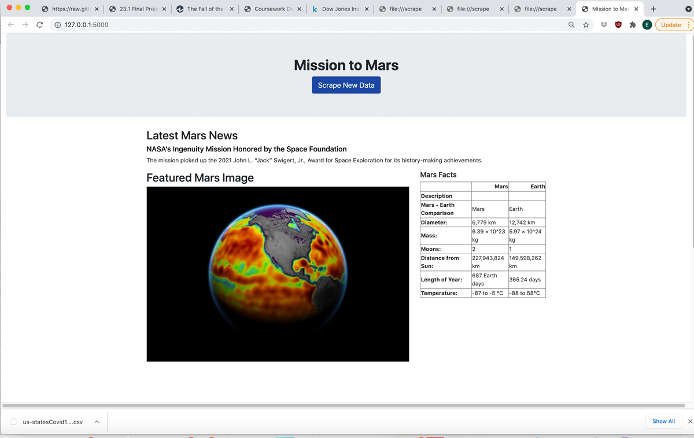
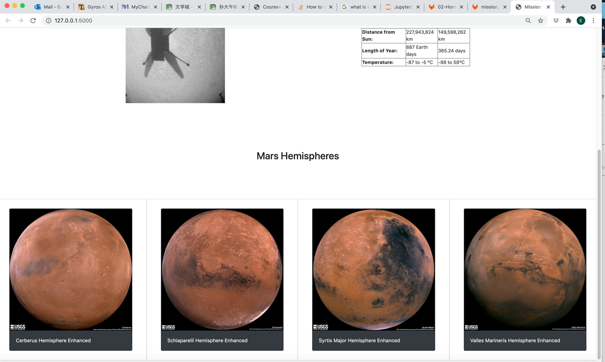
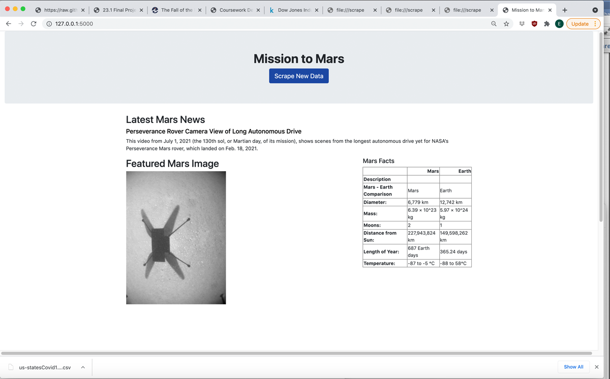
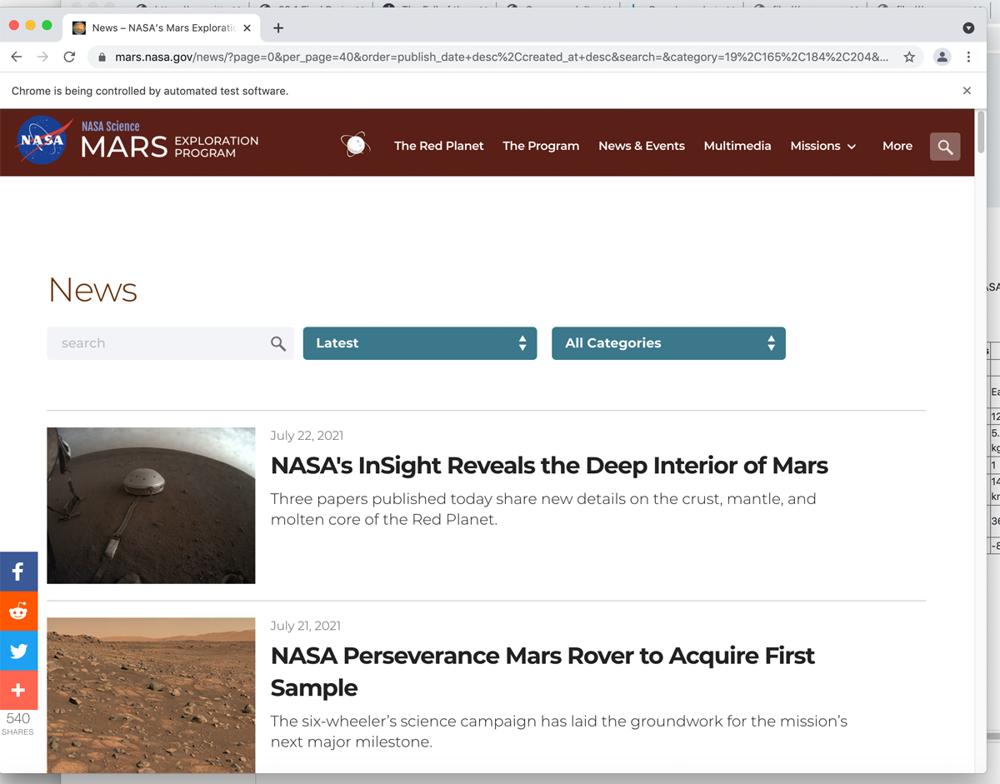
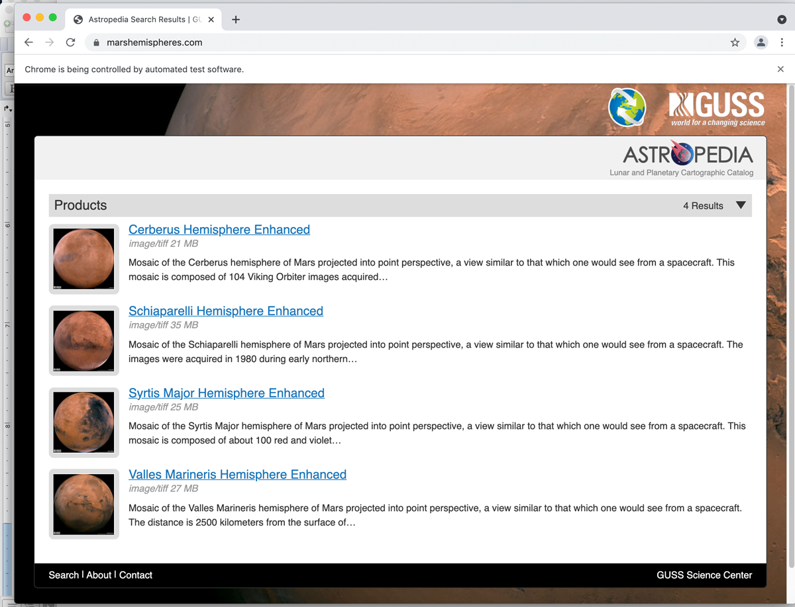

# web-scraping-challenge
In this assignment, you will build a web application that scrapes various websites for data related to the Mission to Mars and displays the information in a single HTML page. The following outlines what you need to do.
Complete your initial scraping using Jupyter Notebook, BeautifulSoup, Pandas, and Requests/Splinter.

Create a Jupyter Notebook file called mission_to_mars.ipynb and use this to complete all of your scraping and analysis tasks. 

Scrape the Mars News Site and collect the latest News Title and Paragraph Text. Assign the text to variables that you can reference later.
Use MongoDB with Flask templating to create a new HTML page that displays all of the information that was scraped from the URLs above.

Create a template HTML file called index.html that will take the mars data dictionary and display all of the data in the appropriate HTML elements. Use the following as a guide for what the final product should look like, but feel free to create your own design.
----------------------------------------------------------------------

Step 1 - Scraping
I have completed the initial scraping using Jupyter Notebook, BeautifulSoup, Pandas, and Requests/Splinter.

I started by converting my Jupyter notebook into a Python script called scrape_mars.py with a function called scrape that will execute all of my scraping code from above and return one Python dictionary containing all of the scraped data.

Next, I created a route called /scrape that will import my scrape_mars.py script and call my scrape function.

Store the return value in Mongo as a Python dictionary.

Create a root route / that will query your Mongo database and pass the mars data into an HTML template to display the data.

Specifically:
I create a Jupyter Notebook file called mission_to_mars.ipynb and use this to complete all of my scraping and analysis tasks. 
Visit NASA MARS News Site that to be scraped
Scrape page into Soup
Debug: examine the result
print(news_soup.prettify())
scrape the first result from the ResultSet (list_text_all):
JPL Mars Space Images - Featured Image
  1) Visit the url for the Featured Space Image site here.   
  2) Use splinter to navigate the site and find the image url for the current Featured Mars Image and assign the url string to a variable called featured_image_url.  
  3) Make sure to find the image url to the full size .jpg image.   
  4) Make sure to save a complete url string for this image.  

Step 2 - MongoDB and Flask Application
I then used MongoDB with Flask templating to create a new HTML page that displays all of the information that was scraped from the URLs above.
Create an instance of Flask
Use PyMongo to establish Mongo connection: 
Set up (DB: mars_info_app, Collection: mars_info)
Route to render index.html template using data from Mongo
Find one record of data from the mongo database
Route that will trigger the scrape function
Run scrapped functions
Update the Mongo database using update and upsert=True

To run this project, open app.py in visual studio code and run this python code by right-click in the code window
and choosing the option "Run Python File in Terminal". You will in the right lower corner "Terminal", you program will run and then mouse over the url http://127.0.0.1:5000/ and click on "follow the link"
# hyperlink to go to the homepage. You will see Mars webpage.

the image of scrolled-down part of Mars Science News

also the scraping webpage image

after click "scraping", you will see scraped webpage from Mars

also other scraped images from Nasa Mars News

